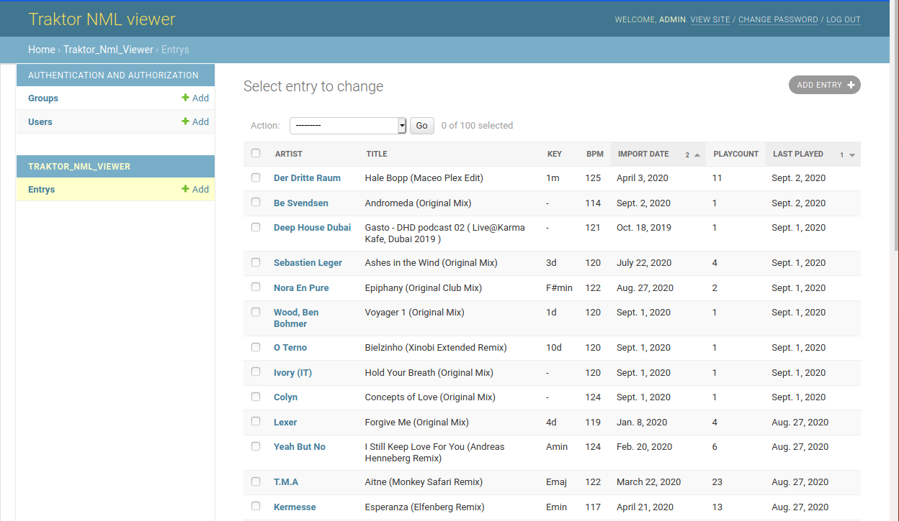

# Traktor NML viewer

View and modify Traktor NML files using Django.
Uses [traktor_nml_utils](https://github.com/wolkenarchitekt/traktor-nml-utils) to parse NML files.

## Usage

Create virtualenv:
```shell
make virtualenv-create
```

Activate virtualenv:
```shell
. .venv/bin/activate
```

Create and migrate SQLite DB:

```shell
python manage.py migrate
```

Import NML file to database:

```shell
python manage.py traktor_nml_import ~/traktor3/collection.nml
```

Create adminuser:

```shell
python manage.py create_adminuser
```

Run server:

```shell
python manage.py runserver
```

Open `http://localhost:8000/admin`, login with admin/adminadmin.
See NML data in browser:


